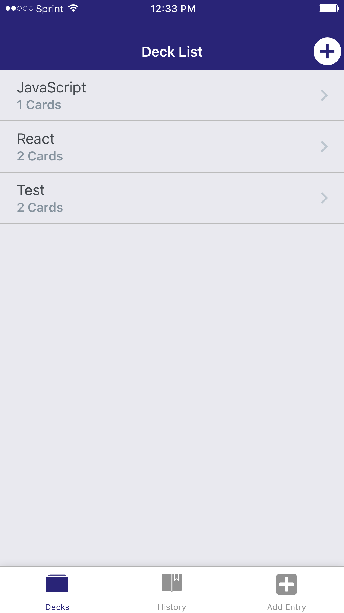
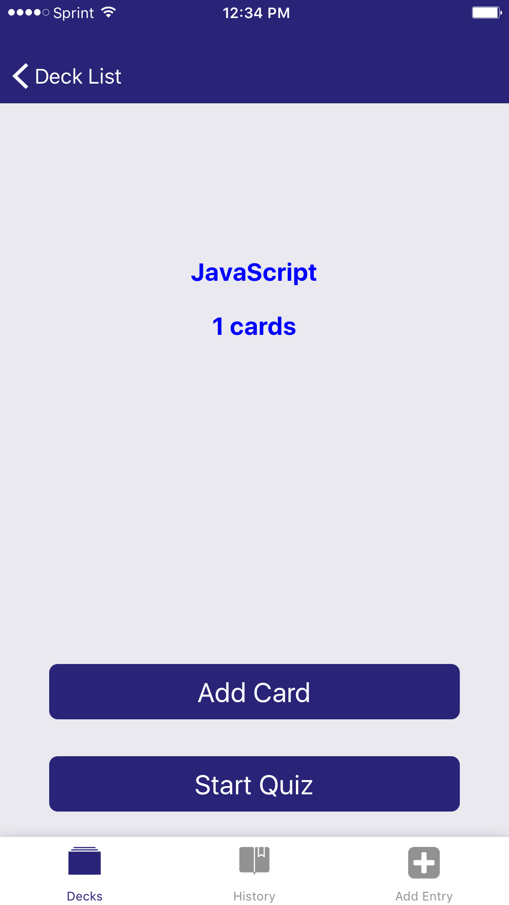
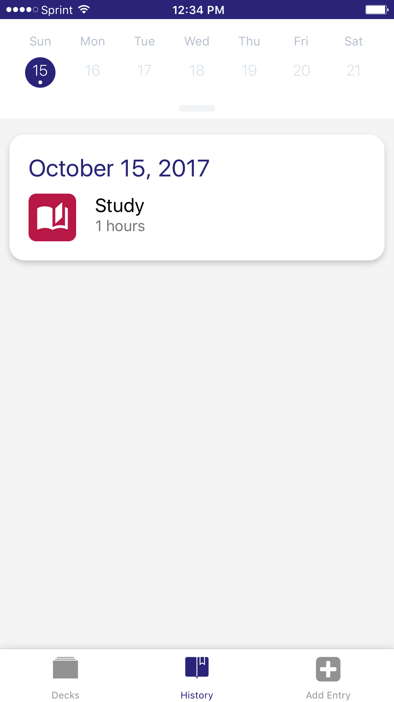
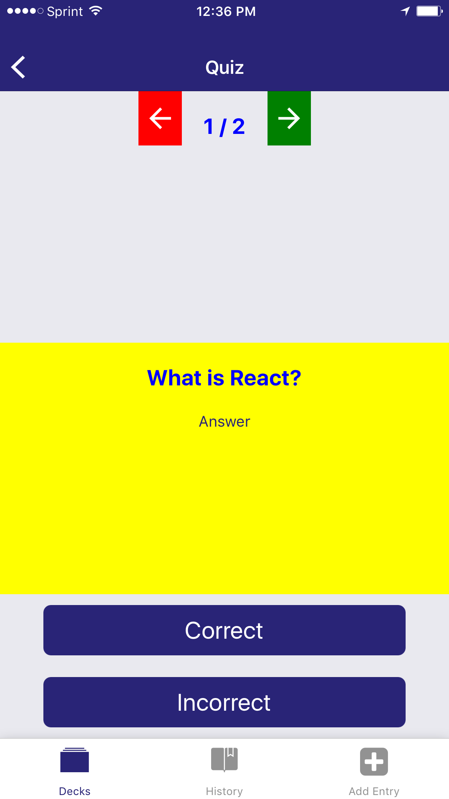

## Project Title:   MOBILEFLASHCARDS

It is a mobile application (Android or iOS - or both) that allows users to study collections of flashcards. The app will allow users to create different categories of flashcards called "decks", add flashcards to those decks, then take quizzes on those decks.

  
  
  
    

## Specification
The project is created using create-react-native-app. Here are some requirements for the app.
1.Allow users to create a deck which can hold an unlimited number of cards.
2.Allow users to add a card to a specific deck.
3.The front of the card should display the question.
4.The back of the card should display the answer.
5.Users should be able to quiz themselves on a specific deck and receive a score once they're done.
6.Users should receive a notification to remind themselves to take a Quiz if they haven't already for that day
## Additional Functionalities
7.Users can see data logged on past days in a user Friendly Calendar. The calendar control is taken from Udacifitness. The calendar is populated with some dummy data
for some days before the install date.
8.Once a user takes a quiz a default value of 1 hour  is assigned for Study metric which the user can then modify through AddEntry tab.
9.Until the user takes the quiz he cannot enter any data for 'Study' metric.

## Data
The app comes with 2 prepopulated decks. AsyncStorage is used to store the data.
## Test
The app was tested in iPhone 6S plus with Expo.

## Installation

Install packages: `yarn install`

Launch application: `yarn start`.

To run the app in the phone install Expo client app. Then scan the QRCode using QRScanner in the Expo app.
